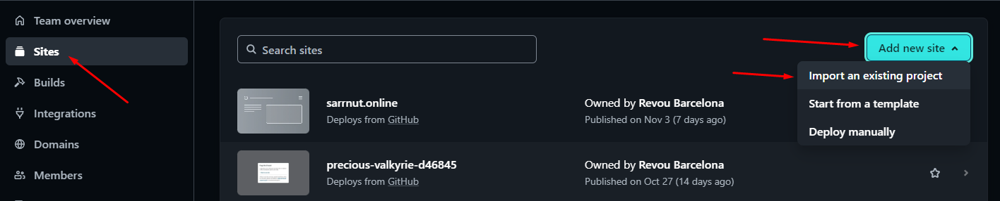
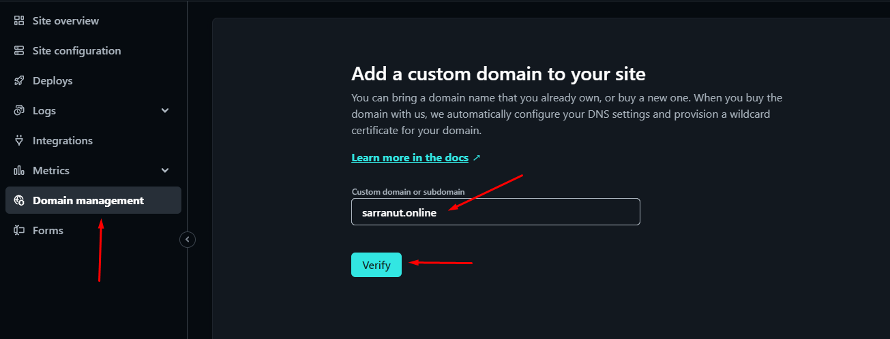

# Read mee 😎😎😎

## sebelah sin kak Kevin

[Link to app  deployed at  netlify ](https://notetodo.online/)

## Diatas text ini ada linknya

# Documentation 

***
As a web developer, the three main languages we use to build websites are HTML, CSS, and JavaScript. We use HTML to structure the site, CSS to design and layout the web page, and JavaScript to create dynamically updating content. For this week, I have build a simple website about Kateda Membership Club using HTML, CSS and JavaScript.
***
## Table of Contents 
1. HTML Structure
2. CSS File
3. JavaScript File
4. Readme File
5. Images File

***
## 1. HTML Structure 
The HTML Structure for each page is as follows:
* Meta
* Link to CSS Files
* Link to JavaScript File
* Header
	* Home Link
	* About Link
	* Contact Link
* Content
	* Activities
	* Facts
	* Technic
	* Video
	* Form
* Footer
	* Copyright
  
You can check the Deployment of this website by clicking this link : [Link Netlify](https://statuesque-lamington-6ee922.netlify.app) 
  
***
## 2. CSS File 
There are two CSS file in this theme:
* stle.css
* responsive.css

##### indexstyle.css
This CSS file is the main stylesheet for the theme. It holds all the values for the different elements of theme and the default color scheme.

##### responsive.css
This CSS file contain responsive web design provides an optimal experience, easy reading and easy navigation with a minimum of resizing on different devices such as tablet and desktop.

***
## 3. JavaScript File 
There is one JavaScript file in this theme:
* index.js

##### index.js
This theme use the alert function and dark mode function of JavaScript.

***
# Deployment Process & Custom Domain 
There are few steps in Deployment Flow, Buy A Domain, Setting Up DNS and Connect Domain to Netlify.

***

## Deployment Flow 
Before sign up to netlify, make sure you have a github account and had push your project to your Github Account. After that, follow this step :
1. Go to [Netlify Website](https://www.netlify.com) 
   
2. Sign Up & Log In to Netlify > Login with GitHub.
   
   

   

3. After the configuration with GithHub, then choose Add New Site > Import an Existing Project.
   
   

4. Connect to git provider > Pick a repository > Choose Site Configuration and Deploy the Site.

****
   

5. After deploy the site, then the deploy link will appear and it will be automatically refreshed every time you push "project" to your GitHub.
   
   

***

## Buy A Domain 
Please do a research which domain site do you prefer to purchase based on the price and needs. (I choose domain from Niagahoster because it's cheap and convincing)
1. Go to [Niagahoster Website](https://www.niagahoster.co.id/)           
   
2. Login > Register > Choose "Search New Domain / Cari Domain Baru".
   
   

3. Type your domain name you want > and then click "Search Now / Cari Sekarang" > click "Choose / Pilih".
   
   

4. Follow the instruction for following payment option.
   
   

5. The Domain Site has been purchased and you can use it.
   
   
    

## Setting Up DNS and Connect Domain to Netlify 
The Domain Name System (DNS) turns domain names into IP addresses, which browsers use to load internet pages. Every device connected to the internet has its own IP address, which is used by other devices to locate the device.

1. Go to your Netlify account, choose your deploy site.
   
   

2. Click Menu "Domain Management" to "Add a Domain" and verify your domain from Niagahoster to Netlify's deploy site. 
   
   

   
   
3. After verify domain, then click "Awaiting External DNS" and "Set Up Netlify DNS for your domain" plus "Verify" it, as follows.
   
    

   

   

4. Next step are Updating your domain's nameserver from Netlify to Niagahoster as follows on the screenshots below.

    

    

    

    

    

    

    

5. Go back to your Netlify account and verify DNS configuration, then wait for external DNS propagation. Probably 1 to 2 hours or max. 24 hours until your domain's link will be ready to publish.  
   
    

    

    

You can check domain of this project by clicking this link : [Domain Niagahoster](https://sarranut.online/) 

***

