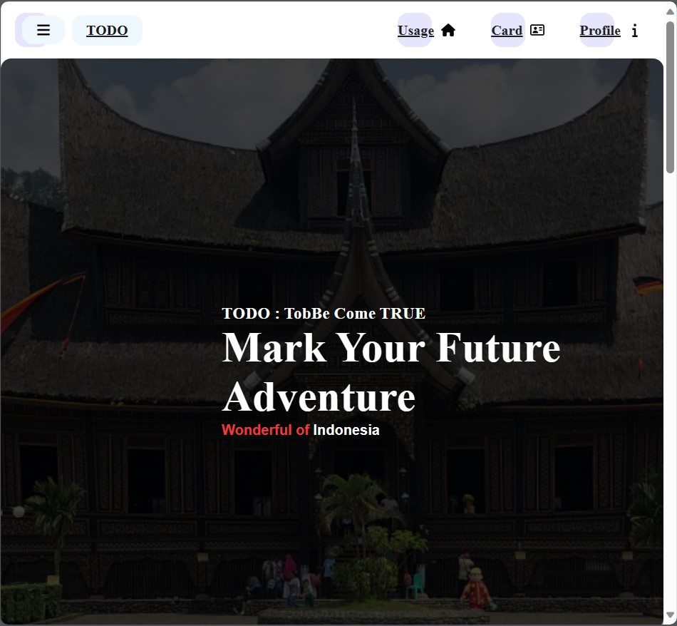
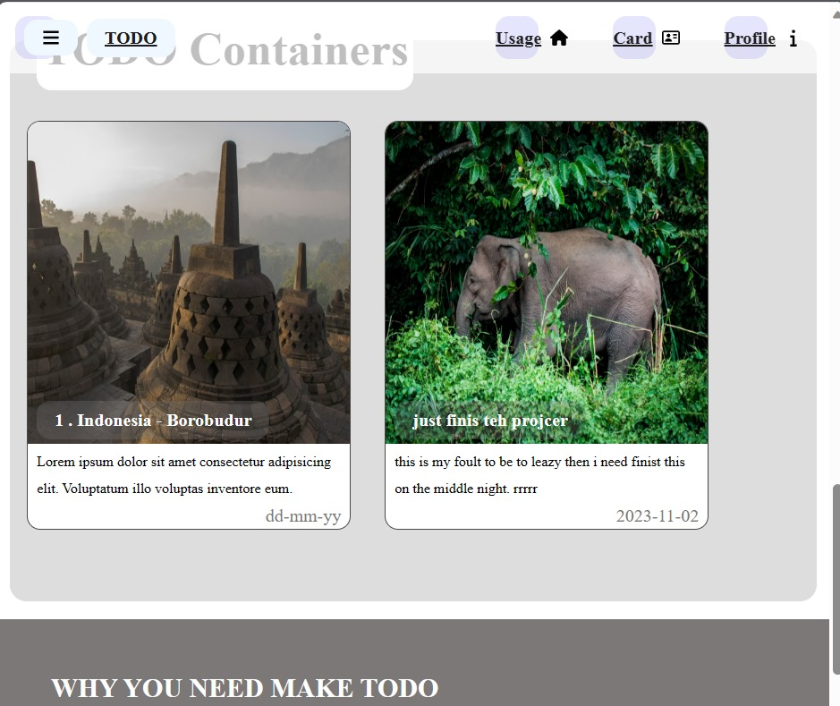

# REVOU-course

---
## week one (make static web page)

### **TODO APP** (Make your dream come true)

  

### ! tab the button below or image above is other option to go the web site

- Netlify : [Link to go to the website, host by netlify](https://main--sprightly-banoffee-3b7821.netlify.app/)

> ## TODO APP (Make your dream come True)
>
>ont the web site above i was make simple TODO app how  have an modal form, when the form was submit the car with data from form will appear
>
> ## WEB FEATURE
> - Simple navigation, link stacked horizontally on the top of website. user can travel around the web just by click the navigation option on display
> - after the hero section ( the greet picture of Minang kabaou House ), serve some usage direction to use the app
> - form of card serve as a modal component which mean can occur just by one click
> - the last part, there is some  video why you should make Some TODO
>
> simple web TODO APP, i make specially to amaze my Team as Friend,also to warn they, there is some place they can make make every things by the own mind and creativity 
> ## Dewa Surya ariest   

### About Me : REVOU SOFTWARE ENGINEERING - SOUL - STUDENT

<h1 align="center">Hi 👋, I'm Dewa</h1>
<h3 align="center">A passionate frontend developer from Indonesia</h3>
<h3 align="left">Connect with me: Letter 😎</h3>

<h3 align="left">Languages and Tools:</h3>

                     

<h2 > " Brief About Me: Dewa 😎 </h2>

   

| Name          | Dewa Surya Ariesta           |
| ------------- | ---------------------------- |
| Hoby          | Watch anime or read manga    |
| Favorite food | every meat                   |
| Hight         | 173 cm                       |
| Wight         | 67 kg                        |
| Occupation    | Freelancer Frontend engineer |

> # Dewa Surya Ariesta - REVOU Student 😎
>
> ### " QURAN, About : 'Make friends with others'
>
> > يٰٓأَيُّهَا النَّاسُ إِنَّا خَلَقْنٰكُمْ مِّنْ ذَكَرٍ وَأُنْثٰى وَجَعَلْنٰكُمْ شُعُوبًا وَقَبَآئِلَ لِتَعَارَفُوٓا   ۚ إِنَّ أَكْرَمَكُمْ عِنْدَ اللَّهِ أَتْقٰىكُمْ   ۚ إِنَّ اللَّهَ عَلِيمٌ خَبِيرٌ
> >
> > "Wahai manusia! Sungguh, Kami telah menciptakan kamu dari seorang laki-laki dan seorang perempuan, kemudian Kami jadikan kamu berbangsa-bangsa dan bersuku-suku agar kamu saling mengenal. Sungguh, yang paling mulia di antara kamu di sisi Allah ialah orang yang paling bertakwa. Sungguh, Allah Maha Mengetahui, Maha Teliti." (QS. Al-Hujurat: Ayat 13)
>
> ## MY Story
>
> ## 
❤️❤️Hallo 😁😁😁😁😂❤️❤️

>
> > ### **My** name is _Dewa Surya Ariesta_, **I** love to learn, make new friend and face new challenge. Already have experience 8 months tech industry where i work as Frontend engineer and ui/ux. every things happen to me is miracle, my friend's invite me on they project and tach me about tech, then Here i join **revou** to gain my knowledge
> >
> > ### **The** skill already i earn by may self is almost everything about frontend. start from design layout on Figma , wrote the code on Angular and use FiraBase as backend service.
> >
> > ### **Frontend development** is my major skill on techno world, the skill come to me just like a blessing and make me fill excited and curious and bring me here, following _revou_ course
> >
> > _Dewa surya Ariesta-REVOU-Student_
> >
> > Wrote this README with LOVE
> >
> > # 
 =❤️❤️❤️=

## Contact ME :

### I'am Sory , i don't have any social media LOL 😁

## =============================================

