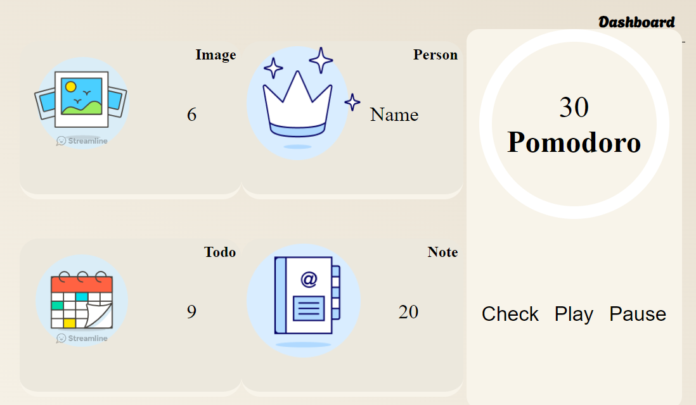
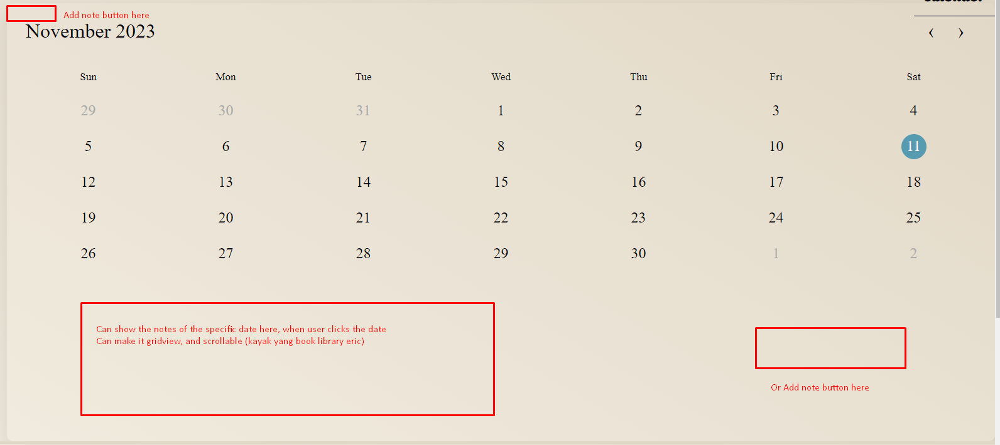

Overall work kamu sih udah sangat advanced ya dew (ada connect ke twitter segala), tapi masalahnya adalah karena saking advancednya, kamu melupakan hal hal basic yang diperlukan dalam requirement seperti:
1. Memakai background-size: cover atau background-size: contain (ataupun cover or contain sebagai setting untuk CSS attribute lainnya)
2. Tidak ada text-shadow di dalam code kamu

2 hal ini yang menyebabkan kamu tidak dapat nilai 3 sempurna untuk semua modul.

Selain itu, untuk feedback lebih advancednya:
1. Untuk bagian dashboard sini, kliatannya seperti smacam card yang bisa di click untuk mungkin lihat image, lihat atau set profile di person, atau mungkin play or pause music etc, jadi rada bingung waktu gabisa

2. Untuk bagian notes, feedback ke user saat click button Add/Save notes atau Image nya bisa lebih diimprove (mungkin saat hover button itu, pointernya brubah, atau ada suatu effect di situ).

3. Saat add new notes, boleh dibikin supaya title and textboxnya langsung bisa diisi untuk notes tersebut (jadi gaperlu klik new notesnya dlu untuk edit)

4. Saat click edit pun, boleh dibikin agar popup edit/deletenya itu tutup dengan sendirinya

5. Dibagian Todo, coba dibikin agar button add sama notes yang dibawah itu bisa langsung di apply di calendarnya, jadi user gaperlu scroll lagi dan bakal lebi jelas UInya. penjelasan di gambar.

6. Di bagian about, tomboll add to my schedule nya bikin bingung, gaada feedback apapun jadi gatau bisa atau ngga

7. Untuk toggle dark modenya, boleh dibuat agar smua isi togglenya itu bisa di click, bukan hanya bolanya doang.

Untuk level teknis sudah sangat bagus dew, cuma yang perlu lebih jauh di improve adalah bagaimana caranya website kamu bisa dibikin relatable untuk user.